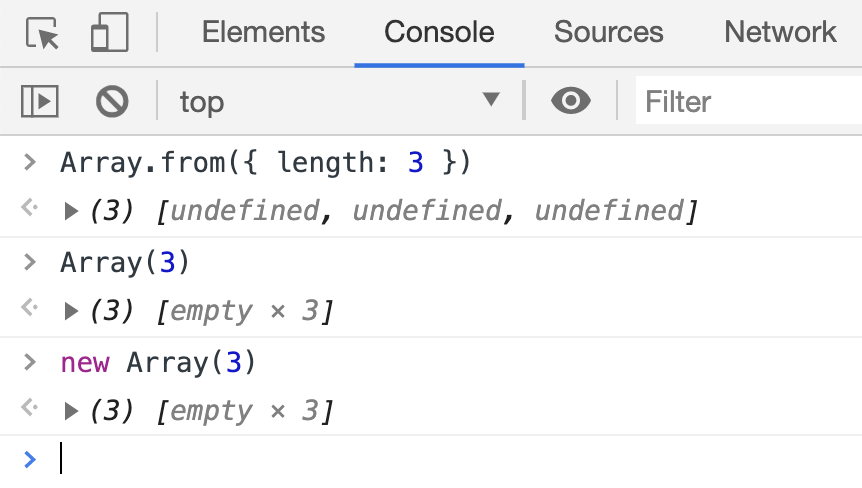

## 描述

`Array.from` 方法用于将两类对象转为真正的数组：类似数组的对象（array-like object）和可遍历（iterable）的对象（包括 ES6 新增的数据结构 Set 和 Map）。

## 语法

```js
Array.from(arrayLikeOrIterable[, mapFunction[, thisArg]]);
```

+ `arrayLikeOrIterable`: 第一个参数是类数组或者可迭代对象，为必传参数
+ `mapFunction`: 第二个参数是一个函数，会在集合中的每一项都调用，其返回值会插入到新的集合中（类似 map 函数的第二个参数），为可选参数。
+ `thisArg`: 调用 `mapFunction` 函数时的 `this` 指向，不常用，为可选参数。


## 示例

### 转化类数组(1)

```js
const arrayLike = {
  "0": 10,
  "1": 20,
  "2": 30,
  length: 3
}

Array.from(arrayLike, (value, index) => value * 2);
// [20, 40, 60]
```

### 转化类数组(2)

```js
let arrayLike = {
  "0": "a",
  "1": "b",
  "2": "c",
  length: 3
};

// ES5的写法
var arr1 = [].slice.call(arrayLike); // ['a', 'b', 'c']

// ES6的写法
let arr2 = Array.from(arrayLike); // ['a', 'b', 'c']
```

### 转化类数组(3)

`Array.from` 会将字符串转化为数组

```js
let str = 'foo'

Array.from(str);
// ["f", "o", "o"]
```

### 初始化数组

使用 `Array.from` 初始化默认每项元素的值是 `undefined`，而使用构造函数初始化默认元素值是 `empty`，在 `map` 等函数中会跳过 `empty` 元素，切记。

```js
Array.from({length: 3})
// [undefined, undefined, undefined]

Array(3)
// [empty x 3]

new Array(3)
// [empty x 3]
```



### 克隆数组

克隆数组的方法有很多，`Array.from` 就能很轻易地**浅拷贝**一个数组：

```js
const nums = [ 1, 2, 3 ];
const nums2 = Array.from(nums);

console.log(nums2); // [1, 2, 3]
nums === nums2;  // false
```

这就说明新数组 `nums2` 和原数组 `nums` 的元素一样，但是已经是两个不同的数组了。

下面例子中 `nums` 和 `nums2` 的（引用类型的）元素是完全相同的，说明用 `Array.from` 是**浅拷贝**一个数组。

```js
const nums = [
  [ 1, 2, 3 ],
  [ 'one', 'two', 'three' ]
]

const nums2 = Array.from(nums)
console.log(nums2);

nums[0] === nums2[0] // true
nums[1] === nums2[1] // true
```

下面做一个尝试，对只包含数组类型元素的数组进行深度克隆：

```js
function recursiveClone (arr) {
  return Array.isArray(arr) ? Array.from(arr, recursiveClone) : arr;
}

const nums = [
  [ 1, 2, 3 ],
  [ 'one', 'two', 'three' ]
]

const nums2 = recursiveClone(nums)

nums[0] === nums2[0] // false
nums[1] === nums2[1] // false
```

通过最后的判断可以看出深度克隆成就已经达成！

这种深度克隆的方法非常简洁，但同时缺点也很明显，那就是这种方法只适合由基本类型和 Array 类型的元素组成的数组，因此使用这种方法之前需要确定自己克隆对象的类型。

### 数组去重

```js
function uniqArr (arr) {
  return Array.from(new Set(arr))
}

uniqArr([ 1, 1, 2, 2, 4, 4])  // [1, 2, 4]
```

类似的数组去重方法还有：

```js
function uniqArr (arr) {
  return [...new Set(arr)]
}

uniqArr([ 1, 1, 2, 2, 4, 4])  // [1, 2, 4]
```


### 填充数组

`Array.from` 函数可以使用相同的值来初始化一个数组

```js
const length = 3
const init = 0
const arr = Array.from( { length }, () => init )

console.log(arr) // [0, 0, 0]
```

> `{ length }` 是 `{ length: length }` 的简化写法

其实，`Array.prototype.fill` 函数也能达到「填充」的效果，而且从名字上看，`Array.prototype.fill` 才是官方指定的「填充」函数。

```js
function fillArray (init, length) {
  return Array(length).fill(init);
}
const result = fillArray2(0, 3);
// => [0, 0, 0]
```

关于 `Array.prototype.fill` 的详细用法请移步[这里](./06-Array.prototype.fill.md)


### 生成数字范围数组

```js
function range(end) {
  return Array.from({ length: end }, (item, index) => index);
}

range(4); // [0, 1, 2, 3]
```


## 参考文章

+ [5 Handy Applications of JavaScript Array.from()](https://dmitripavlutin.com/javascript-array-from-applications/)